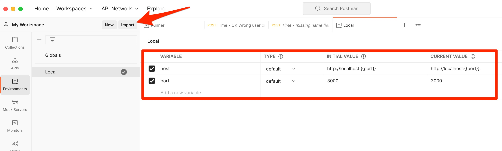
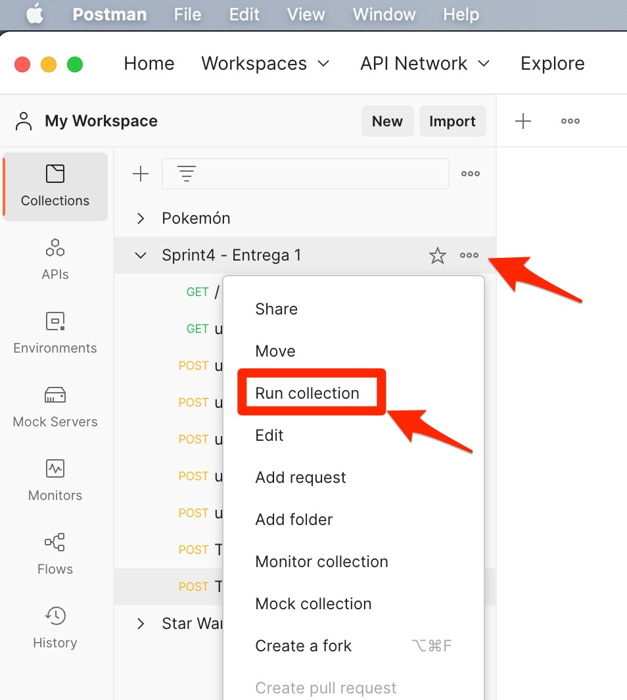
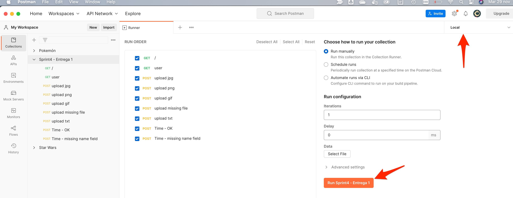
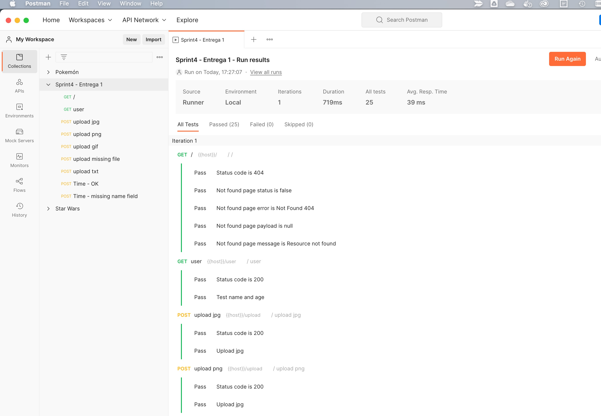

## Description
Dice game. You can create a player and trow 2 dices. If the sum of both dices are 7 you win otherwise you lose.

## How to install

1. Clone this repo
2. Enter at the project folder `cd sprint4-entrega2`
3. Database, two options:
    - Docker:
        1. Open docker application (if you do not have installed, download it [from here](https://www.docker.com/))
        2. Enter the docker folder `cd docker`
        3. Run `docker compose up -d`
    - Your local database:
        1. Edit the `.env` file to fit your database configuration.
6. Go to the root project folder `cd .. `
7. Install dependencies `npm install`
8. Run `npm run start` (for development you can use `npm run dev` instead)

Now you are ready to consum the API. Use your favorite API test, like POSTMAN

## Postman
1. Open POSTMAN
2. Configure environments, two option:
    1. You can import from [this file](./__tests__/Sprint4-Entrega2.postman_collection.json)
    1. Copy manually the values for host and port.  
    
3. Import the project collection located at [this file](./__tests__/Sprint4%20-%20Entrega%201.postman_collection.json)
    - WARNING: The collection pre-script add the "user-token" header to all collection.

## Run Automatic tests with POSTMAN

1. Click at the 3 dots "Run collection"

2. Choose "Local" enviroment and click "Run sprint4"

3. At the tab "All tests" you will able to see all tests results.


## Folder structure
```
.
├── README.md
├── __tests__
│   ├── Local.postman_environment.json
│   ├── Sprint4-Entrega2.postman_collection.json
│   └── app.test.js
├── app
│   ├── app.js
│   ├── config
│   │   └── config.js
│   ├── controllers
│   │   └── controller.js
│   ├── db.js
│   ├── helpers
│   │   └── helper.js
│   ├── middlewares
│   │   └── middleware.js
│   ├── models
│   │   ├── Dice.js
│   │   ├── NotFound.js
│   │   ├── Response.js
│   │   ├── matches.js
│   │   ├── players.js
│   │   └── users.js
│   └── routes
│       ├── api
│       │   ├── games.js
│       │   ├── notfound.js
│       │   ├── players.js
│       │   ├── ranking.js
│       │   └── users.js
│       └── route.js
├── assets
│   ├── check-tests.jpg
│   ├── environments.jpg
│   ├── run.jpg
│   ├── running-collection.jpg
│   └── working-directory.jpg
├── docker
│   └── docker-compose.yml
├── package-lock.json
└── package.json

```

## Ref
1. [Sequelize - Getting Started](https://sequelize.org/docs/v6/getting-started/) 

2. [(Youtube) Crea un API Rest con Express y MySQL - parte 1](https://www.youtube.com/watch?v=T6rGUZGAWBk)

3. [(Youtube) Crea un API Rest con Express y MySQL - parte 2](https://www.youtube.com/watch?v=0bl0vfV3g-c&t=0s)

4. [(Youtube) Crea un API Rest con Express y MySQL - parte 3](https://www.youtube.com/watch?v=bjeBrHdyg5g&t=0s)

5. [(Youtube) Crea un API Rest con Express y MySQL - parte 4](https://www.youtube.com/watch?v=50dugGTFvi8&t=0s)
