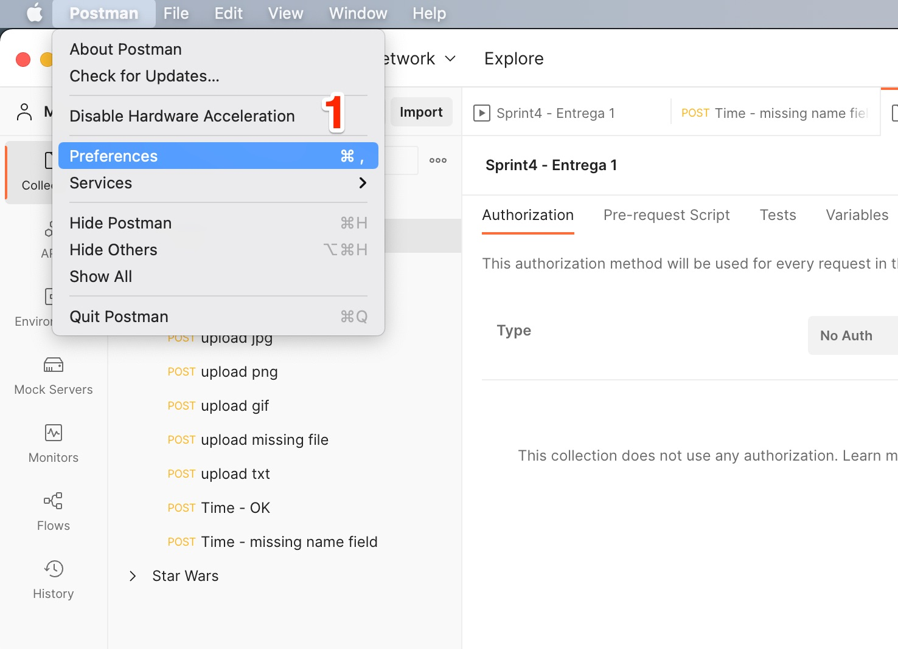
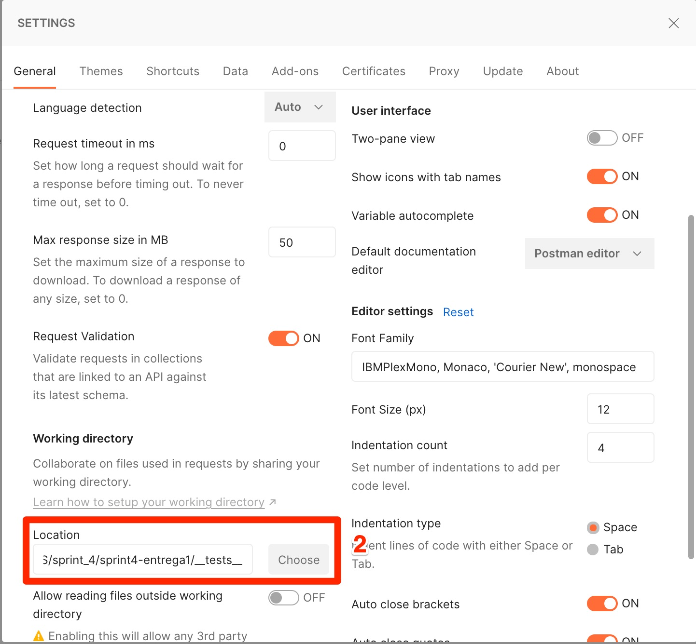
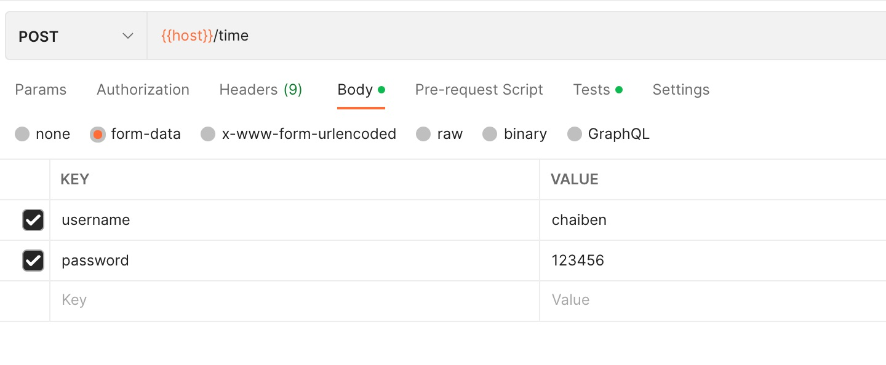

## How to install

1. Clone this repo
2. Enter at the project folder `cd sprint4-entrega1`
3. Install dependencies `npm install`
4. Run `npm run start` (for development you can use `npm run dev` instead)

## How to run the automatic tests
1. Configure environments, two option:
    1. You can import from [this file](./__tests__/Local.postman_environment.json)
    1. Copy manually the values for host and port.  
    
2. Open POSTMAN
3. Import the project collection located at [this file](./__tests__/Sprint4%20-%20Entrega%201.postman_collection.json)
4. Open preferences - marked with number "1"

5. Add the test folder as a working directory (see number 2 below)

6. Click at the 3 dots "Run collection"

7. Choose "Local" enviroment and click "Run sprint4"

8. At the tab "All tests" you will able to see all tests results.


## Test manually

If you want to test manually, you can use username = 'chaiben' and password = '123456' as a valid loggin credentials for the "time" enpoint.


## Folder structure
```
.
├── __tests__: Files that are being used for tests
├── app
│   ├── app.js: Main app file
│   ├── config: Not being used
│   ├── controllers: Not being used
│   ├── helpers
│   │   └── helper.js: File with all api messages
│   ├── middlewares: Not being used
│   ├── models
│   │   ├── NotFound.js:  Not found resouce error model
│   │   ├── Response.js: Template that format the API response
│   │   ├── Upload.js: Upload call model
│   │   └── User.js: User call model
│   └── routes
│       ├── api
│       │   ├── notfound.js
│       │   ├── upload.js
│       │   └── user.js
│       └── route.js
├── img: Not being used
├── package.json: Project dependencies
└── uploads: Folder that all uploaded files are saved

```

## Ref
1. [How to get the full URL in Express?](https://stackoverflow.com/questions/10183291/how-to-get-the-full-url-in-express) 
2. [Cache headers in Express js app](https://regbrain.com/article/cache-headers-express-js)
3. [Handling CORS with Node.js](https://stackabuse.com/handling-cors-with-node-js/)